# Garden — Design (v0.2, 2026-10-03)

> Personal finance for Brazil that knows **who** you paid, **where**, and **what's already committed**.
> Native SwiftUI · iPhone / iPad / Mac · deployment target 27 · Cloudflare Worker backend.

Companion docs: [FLOWS.md](FLOWS.md) (user flows and tap budgets), [ICON.md](ICON.md) (Icon Composer plan), [REVIEW.md](REVIEW.md) (what the review agents found, and what changed because of it).

---

## 1. Why Garden

| Complaint | Why other apps fail | Garden's answer |
|---|---|---|
| "Doesn't know if I paid Americanas or the local shop" | Brazilian card descriptors are processor strings (`PAG*JOSE`, `MP*LOJA`, `SUMUP*`, `IFD*`), and no BR app keeps a **merchant entity**. | Merchant is a first-class entity. It's resolved from the **CNPJ** (Open Finance `paymentData.receiver.documentNumber` or Pluggy `merchant.cnpj`) through the Receita registry (fantasia, CNAE, address). Garden also unwraps processor prefixes and uses the location captured at tap time. A **chain / local / online** badge answers the question directly. |
| "Where am I wasting money?" | No BR app has a map. | **Onde gastei**: a MapKit hex-grid heatmap fed by tap-time GPS plus geocoded CNPJ addresses. It always says how much of the spending it covers ("62 % com local"). |
| Tags are noise | Tags describe spending; they don't constrain it. | **Budgets (Limites) are the organizing unit.** A merchant can be assigned to a budget ("Atacadão → Mercado"). Category is metadata. |
| A Pix to myself counts as spending | No BR app pairs your own accounts. | Transfers are paired by Pix **E2E id**, then by your own counterparty account, then by CPF. |
| Parcelamentos are card-only and manual | BR apps only offer a manual flag. | **Installment plans** are detected on cards (`installmentNumber/totalInstallments`, "PARC 03/10"). They can also be declared for anything else: carnê, boleto, Pix parcelado, crediário, a friend. Future parcels reduce *Sobra do mês*. |
| The balance shown is wrong | Racha refunds count as income, a saque counts as spending, and a 10x purchase counts twice. | **Linked transactions**: refunds, racha, cashback and IOF attach to the original purchase, so each purchase has a **net cost**. A saque moves money into the *Carteira* account. |

Reference products studied:
- **WalletPal**: Apple Pay capture via Shortcuts, a calendar heatmap, "left to spend · resets in N days", and a payment timeline for subscriptions.
- **Copilot Money**: the To Review queue, recategorizing inline in 2 taps, rules created from a correction, the R/I/T transaction types, and budget rollover/rebalance.

---

## 2. Hard constraints (from research — read first)

1. **FinanceKit is US/UK only.** No Apple API exposes Brazilian Apple Pay history. Real-time capture has to come from **Shortcuts automations** that call a Garden App Intent.
2. **The Wallet "Transaction" trigger is unreliable for some BR issuers.** Nubank is reported broken, Mastercard is flaky, it fires on declines, and it's iPhone-only. An iOS 27 **"Notification received"** trigger was reported (WWDC26 session 310, MacRumors), which would let bank push notifications cover Pix and physical cards. **⚠️ Not yet verified on a device. Phase 0 includes a spike with your real cards.** Without it, real-time capture covers only Apple Pay; everything else arrives through Pluggy with a 1–2 day delay.
3. **Meu Pluggy is free, personal-use only, limited to ≤ 5 connections, and not for commercial use.** Garden can only read proxy items (connector 200), which refresh **every 24 h**. `PATCH /items` is rejected and `GET /v2/items` is unavailable, so Garden must store the itemIds itself. Expect **1–2 days of latency**.
   - Garden is therefore a **bring-your-own-Worker, bring-your-own-Pluggy-credentials** app, like Actual Budget.
   - Running it as a commercial service would need a paid Pluggy contract.
   - Enable the MeuPluggy connector **before the 15-day dashboard trial ends**.
4. Pluggy `merchant`/`category` may be **Pro-gated after the trial** (unverified). Pluggy data is treated as a hint, never as a requirement.
5. **Pluggy ids are unstable.** An edit arrives as a delete plus a create, and reconnecting issues new ids. Identity comes from `providerId` scoped by account and direction, or from a content hash on a **stable account identity** (institution + branch + number), never Pluggy's `accountId`.
6. **Pluggy webhooks are unsigned.** Garden only uses polling (§13).
7. **SwiftData stores `Decimal` as REAL.** Money is stored as `Int64` centavos plus an ISO currency code.
8. **SwiftData + CloudKit** allows no `#Unique`, needs every relationship optional and every property defaulted. Garden handles this with a **single-writer ingestion lease**, **deterministic UUIDv5 ids**, and a deterministic dedupe pass after each CloudKit import (§4.4).
9. **MapKit has no native heatmap.** Hex-grid aggregation is drawn as `MapPolygon`.
10. **The `/transactions` v1 endpoint is removed on 2026-12-31.** Garden uses `/v2/transactions` (cursor `next`) only.
11. **`allowedExecutionTargets: IntentExecutionTargets` exists in the iOS 27 SDK** (verified in `AppIntents.swiftinterface`). The capture intent runs in the App Intents extension.

---

## 3. System architecture

The review simplified this (see [REVIEW.md](REVIEW.md) C3 and M13). The Worker became a **stateless proxy**: no D1, no Queue, no webhook, and it stores no financial data.

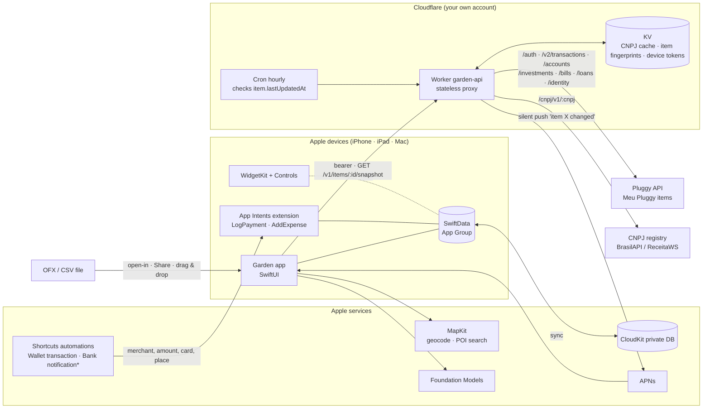

| Layer | Owns | Does *not* own |
|---|---|---|
| Worker | Pluggy secrets; the 2 h apiKey (cached in isolate memory, re-auth on 401); the hourly `lastUpdatedAt` check; the "changed" push; trailing-window snapshots built on request; CNPJ enrichment cache; pairing | Any stored transaction data, categorization, budgets, user edits |
| Device (ingestion leader) | Pulling snapshots, the pipeline, reconciliation, tombstones | n/a |
| Every device | Viewing and editing the ledger (synced through CloudKit), insights, map | Pluggy secrets |

---

## 4. Ingestion pipeline

### 4.1 Single writer

Only the **ingestion leader** pulls from the Worker and turns Pluggy data into transactions. The leader holds a 10-minute lease (`POST /v1/lease`) and renews it while it works.
- The leader defaults to the iPhone. The Mac takes over when the iPhone hasn't renewed for 24 h.
- Captures (Apple Pay or notification), manual entries and OFX imports are written by whichever device produced them.
- Reconciliation runs on **every** insert and **every** CloudKit import, so it works whichever side arrives first.

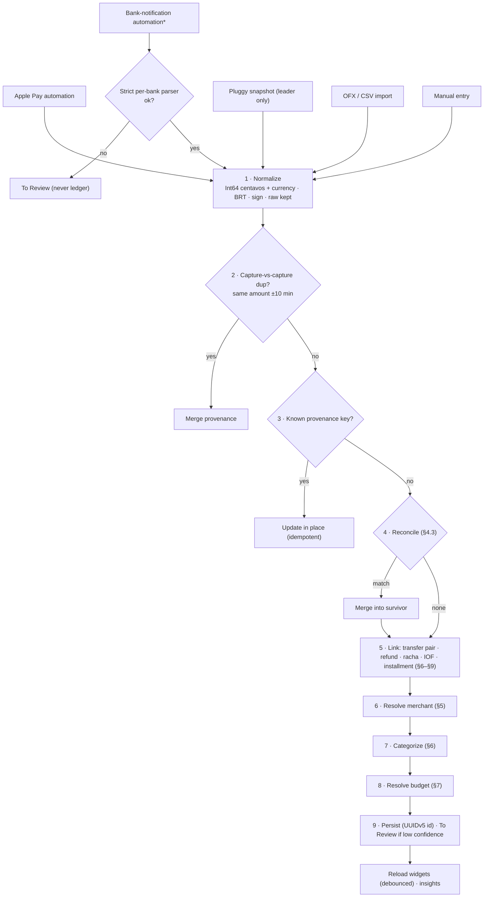

### 4.2 Identity and provenance

Each Transaction carries `provenanceKeys: [String]`, which grows when rows are merged:

```
pluggy (Open Finance)   pid:{stableAcct}:{in|out}:{providerId}
pluggy (other)          plg:{stableAcct}:{yyyy-MM-dd}:{amountCents}:{normDesc}:{installmentNumber?}
ofx                     ofx:{stableAcct}:{FITID}      (fallback: hash like plg: with ofx prefix)
capture                 cap:{source}:{hash(bank, body|merchant, amount, minute)}
manual                  man:{uuid}
stableAcct              sha256(institutionISPB | branch | number | subtype)
```

- `id = UUIDv5(namespace, firstProvenanceKey)`. If two devices create the same row, they produce the same id, so CloudKit collapses the copies.
- Pluggy **PENDING** rows are *provisional*. They go through reconciliation and are not treated as identity. PENDING → POSTED merges into the same row.
- Garden doesn't use `ordinalWithinDay`, because it changes with arrival order.

### 4.3 Reconciliation (capture ↔ bank posting), always 1:1

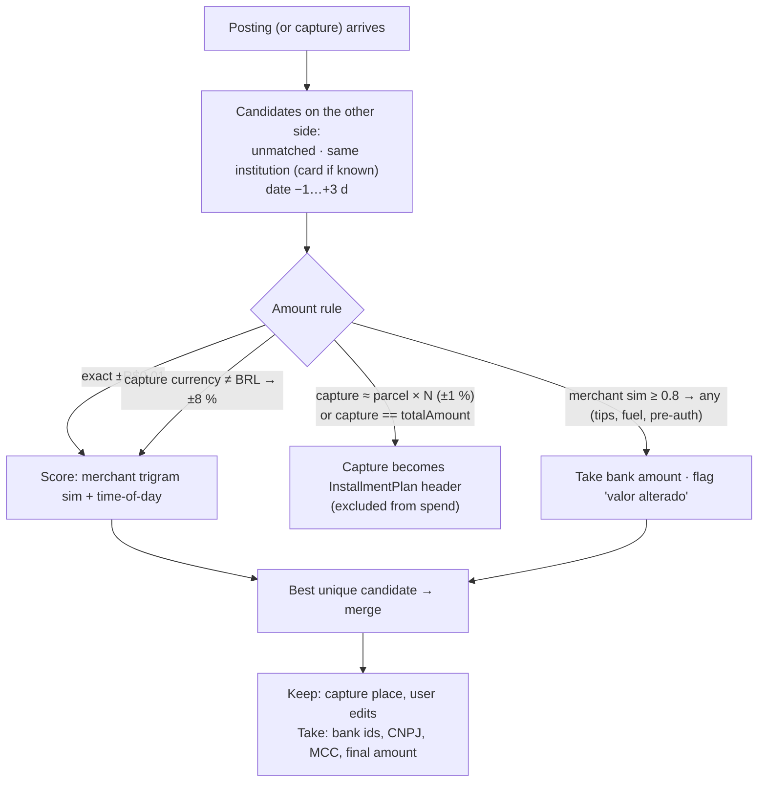

- A capture with no match after 10 days gets the **"Não apareceu no banco"** badge. Declined Apple Pay taps fall here.
- Every merge can be undone ("Separar"), because provenance keeps each source intact.

### 4.4 Updates, deletes, CloudKit duplicates

- **Updates and deletes:** the leader pulls a trailing window (default 35 days) whenever an item's `lastUpdatedAt` changes.
  - A row in the window that is missing from the snapshot becomes a **tombstone** (soft delete for 30 days, then purged).
  - Rows that the user edited are kept and flagged instead.
- **After each CloudKit import:** rows that share a provenance key are grouped.
  - The survivor is the row with the smallest `id`, then the earliest `createdAt`.
  - User-edited fields are merged field by field, last write wins.
  - The rest are deleted.
  - This is deterministic, so every device makes the same decision.
- **Account remapping after consent renewal:** `stableAcct` doesn't change, so a new Pluggy `accountId` is just remapped.

---

## 5. Merchant resolution ("who did I pay?")

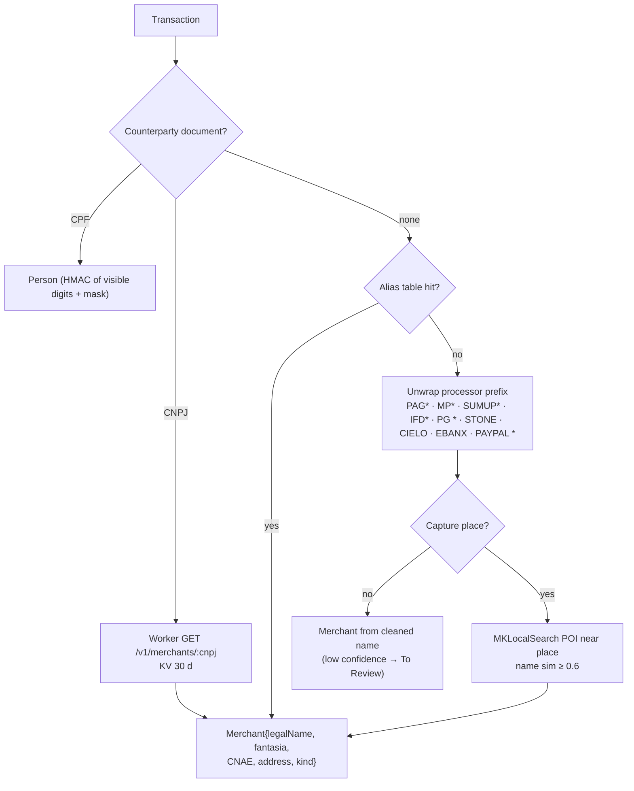

- **kind** is one of `chain`, `local`, `online`, `government` or `person`. It's `chain` when the CNPJ root (8 digits) has many branches, or when the merchant is on the bundled chain list (Americanas, Magalu, Carrefour, Atacadão, Assaí, Pão de Açúcar, iFood, Uber, 99, Shopee, Mercado Livre…).
- **Online** merchants (iFood, Shopee, Amazon, Mercado Livre, CNAE 4713-0/04…) are excluded from the map, because their address is a headquarters. They get an "Online" bucket instead.
- `MP*` is ambiguous (a purchase vs. a Mercado Pago top-up or transfer). Without a CNPJ it goes to To Review instead of being counted as spending.
- **Brand catalog** (`Garden/Resources/Brands.json`, 132 brands: mobility, delivery, marketplaces, supermarkets, pharmacies, streaming, telecom and utilities, airlines and more). Each brand lists the descriptor fragments banks print, a category and the brand's domain. The longest pattern wins and matches respect word edges ("TIM SA" yes, "OTIMISTA" no). Channel brands categorize without taking over the merchant: `IFD*RESTAURANTE SABOR` is merchant *Restaurante Sabor*, category *Delivery*.
- **Company registry:** any CNPJ (Open Finance, BTG Pix notifications) is looked up through BrasilAPI (Receita Federal data): trade name, CNAE and address. `CNAECategories` maps the CNAE by longest prefix ("4789004" → Pets, "47" → retail). The partners list (`qsa`) is personal data and is never stored.
- **Logos** come from the brand's own site, on device: `/apple-touch-icon.png`, then the largest `<link rel="icon">` the homepage declares, then LinkPresentation. Icons under 48 px are rejected (a blurry logo is worse than the category symbol). Logos are cached in Caches/Logos, and misses are retried after 7 days. No third-party logo service ever learns which merchants you pay.

---

## 6. Categorization & linking

**Category precedence.** The first hit wins. The confidence is stored, and low-confidence rows go to To Review.

| # | Source | Conf. |
|---|---|---|
| 1 | Manual override | 1.0 |
| 2 | User rule, created from a correction | 1.0 |
| 3 | Merchant memory | 0.95 |
| 4 | CNAE → category (bundled) | 0.85 |
| 5 | MCC → category (`payeeMCC`) | 0.8 |
| 6 | Pluggy `categoryId` map | 0.7 |
| 7 | MapKit `pointOfInterestCategory` | 0.65 |
| 8 | Foundation Models `@Generable` (pt-BR, constrained to category ids) | 0.5–0.7 |
| 9 | Uncategorized | 0 |

**Linked transactions** (`linkedTo`, `linkKind`). A purchase's **net cost** = its amount − linked credits. Budgets count net cost.

| linkKind | Detection | Effect |
|---|---|---|
| `refund` (estorno) | Credit from the same merchant, ≤ the original amount, within 120 days | Reduces the original's net cost; never income |
| `reimbursement` (racha) | A Pix received from a Person within 7 days of an expense the user marked "Dividi" (or suggested when the received amount ≈ expense ÷ k) | Reduces net cost; the Person shows "Maria te pagou R$ 60" |
| `cashback` | Card operationType `CASHBACK` | Reduces the card's spending in the month; not income |
| `fee` (IOF) | "IOF" line on the card within 3 days of a foreign purchase | Added to the purchase's net cost |
| `transferPair` | §8 | Both sides excluded from spending |

---

## 7. Budgets (Limites), *Sobra do mês*, income

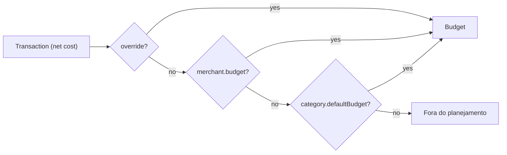

- A Budget has a name, symbol, color, limit, period, rollover, and **members = categories ∪ merchants**. It also has an optional **planned big purchase** (e.g. the monthly Assaí shop), so the pace isn't shown red from day 3.
- **Month = pay cycle.** The month starts on payday (**the 5th** for you; configurable). Adiantamento + salário are one income. 13º, férias and PLR are **renda extra**: shown separately and kept out of the baseline.
- **Sobra do mês** (the widget number) has two modes:
  - *Plan mode* (default): `Σ budget limits − Σ net spent in budgets − Σ unlinked commitments due this cycle`
  - *Income mode*: `income received this cycle + declared recurring income not yet received − Σ net spent − Σ unlinked commitments due this cycle`
  - A **commitment** is a bill or parcel that is due this cycle, **not yet linked** to a transaction, and whose plan uses per-parcel accounting. This prevents counting it twice (once as a commitment, once as spent).
- **Card basis:** spending is counted on the purchase date. The fatura view (§9) shows what is owed.

---

## 8. Transfers, cash, same-person Pix

Signals are checked in order. The first hit decides.

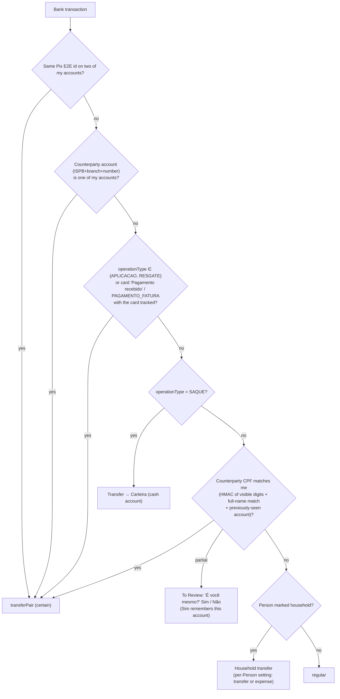

- `TRANSFERENCIA_MESMA_INSTITUICAO` is **not** auto-transfer, because it also covers paying a friend at the same bank.
- A mirrored amount with no account or E2E evidence only goes to To Review; it is never applied automatically.
- **Invoice payment when the card is not tracked** counts as an expense on "Cartão (não conectado)", so spending isn't lost.
- **Cash:** Carteira is a manual cash account. A saque moves money into it, cash purchases (manual or voice) draw from it, and spending is counted once.
- **CPF storage:** `HMAC-SHA256(deviceKey, visibleDigits)` plus the mask pattern. The key lives in iCloud Keychain, never in plain storage. A salted SHA-256 of an 11-digit CPF would be brute-forceable.

---

## 9. Parcelamentos, contas a pagar, fatura

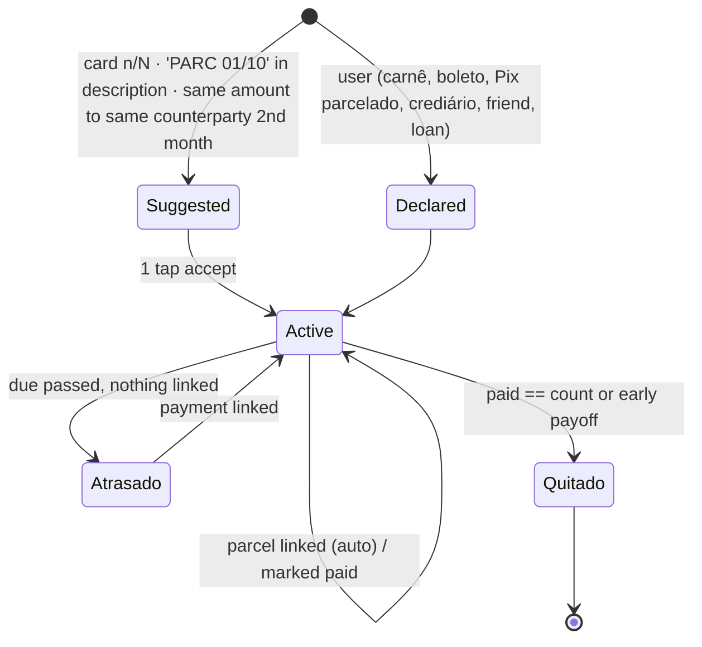

- **Card plans** are grouped by `(stableAcct, merchant, purchaseDate, totalInstallments)`. A matching Apple Pay capture becomes the **plan header** (§4.3).
- **Accounting:** *each parcel in its month* (default) or *full amount at purchase*. With full amount, future parcels are **not** commitments.
- **Loans** (`/loans`) are plans whose remaining balance comes from Pluggy. A recurring debit matched to a loan is linked to it, not counted again.
- **Contas a pagar** is one list with due dates and paid status. It covers detected recurrings (rent to a Person, condomínio with a variable amount), boletos (from a barcode scan, a pasted digitable line, or a bank notification), Pix agendado and Pix Automático (from notifications when available, or declared), débito automático, loan parcels and installment parcels. It feeds *commitments*.
- **Fatura view** (per tracked card): open bill, closing date, due date and limit from `creditData` and `/bills`. A partial payment leaves the remainder as a liability. Rotativo interest and fees post to **Juros e tarifas**.

---

## 10. Meu dinheiro: investments & net worth

- **Holdings:** Pluggy `/investments` plus manual entries. The headline uses **net** value (`balance − taxes`, checked against the bank app) and is broken down by liquidity:
  - **Disponível hoje** (liquidez diária)
  - **Até 30 dias**
  - **Resgate a partir de** {dueDate}

  An investment `Account` and its holdings are never added together.
- **Net worth** = assets − liabilities. Each liability has **one source**:
  - **Card:** open and closed bills plus card-detected future parcels. Pluggy's `balance` is ignored, because it already contains parcels for some issuers.
  - **Loans:** `/loans` outstanding. Linked plans are not subtracted again.
  - **Declared plans outside a card:** their remaining parcels.
- **`NetWorthSnapshot`** is keyed by day (`UUIDv5("nw:"+yyyy-MM-dd)`), so concurrent writers collapse into one row.
- **Chart:** Swift Charts `AreaMark` + `LineMark` (`.monotone`), with `chartXSelection` scrubbing over 1M / 6M / 1A / Tudo.

---

## 11. Insights

| Insight | Rule | Copy |
|---|---|---|
| Category drift | Cycle pace vs. median of the last 3 cycles, > +20 % **and** > R$ 100 | "Comer fora está 34 % acima do normal" |
| Fixed-cost creep | A recurring payment (rent, condomínio, internet) changed vs. its last occurrence | "Aluguel subiu 8 % (R$ 2.300 → R$ 2.484)" |
| New recurring | Same counterparty, ±10 %, ~monthly, 3 occurrences | "Parece mensal: Academia X" |
| Hotspot | Map cell spend > 2× its 3-cycle average | "Você gastou mais no Centro este mês" |
| Concentration | Top merchant > 25 % of a budget | "iFood é 41 % de Comer fora" |

Budget rows show "vs. normal" inline, so a trend can be checked without waiting for an insight. Foundation Models writes only the one-line summary, built from these structured facts.

---

## 12. Domain model (SwiftData, CloudKit-safe)

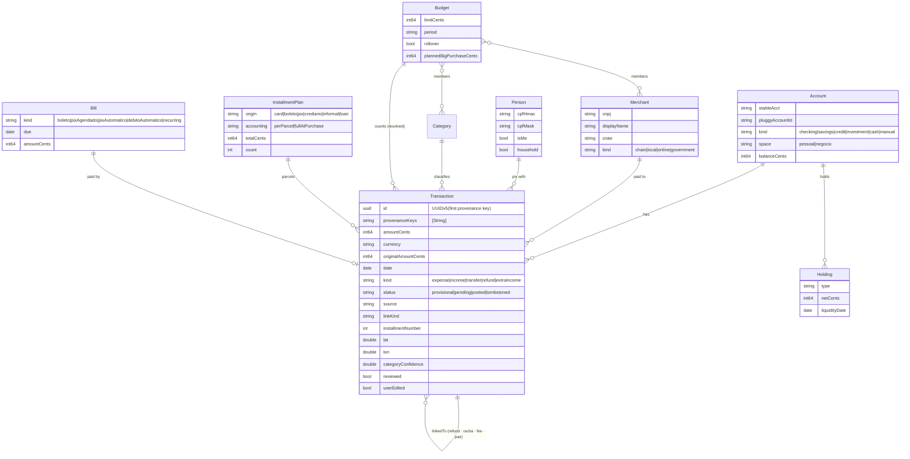

`space` (Pessoal / Negócio) is in the model from day one, though its UI ships later (§18). That means a MEI owner's CNPJ account can be added later without migrating data.

---

## 13. Cloudflare Worker (`worker/`), a stateless proxy

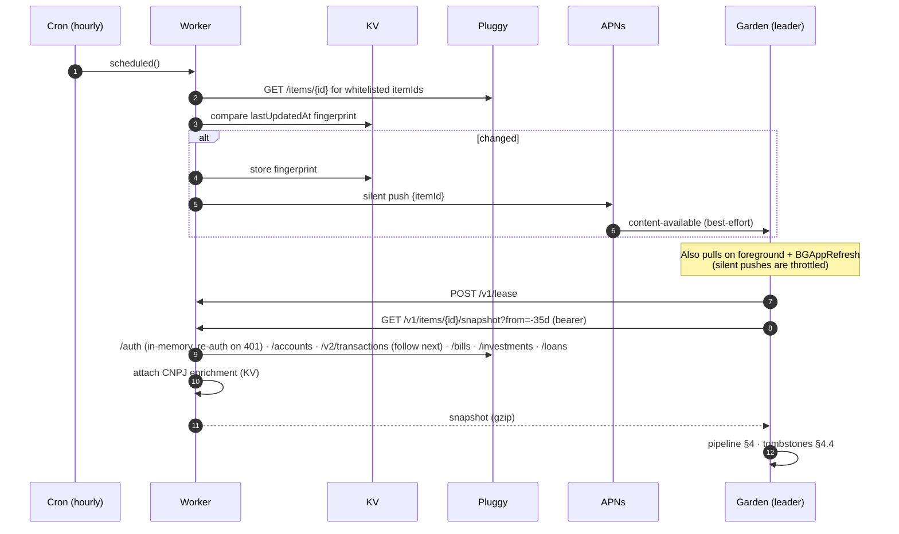

| Route | Purpose |
|---|---|
| `POST /v1/pair` | Swaps a **single-use, 10-minute** setup code for a bearer token. Rate-limited to 5/h. KV stores only the token's hash. Tokens can be revoked. |
| `GET /v1/items` / `PUT /v1/items` | Status of the whitelisted Meu Pluggy itemIds (`lastUpdatedAt`, `status`, `executionStatus`, `consentExpiresAt`), and editing that whitelist |
| `GET /v1/items/:id/snapshot?from=` | Trailing-window snapshot. The Worker builds it per request, streams it and stores nothing. `from=-12m` does the backfill. |
| `POST /v1/lease` | Ingestion leader lease (10 min, in KV) |
| `GET /v1/merchants/:cnpj` | CNPJ enrichment, cached in KV for 30 days |
| `POST /v1/devices` | Registers an APNs token |
| `scheduled` hourly | Checks `lastUpdatedAt` and sends a push only when it changed (no wasted pulls; per-consent quotas are protected) |

Security:
- **Secrets:** `PLUGGY_CLIENT_ID`, `PLUGGY_CLIENT_SECRET`, `SETUP_CODE_SEED`, `APNS_KEY_P8` (a token-based key scoped to the app's topic), `APNS_KEY_ID`, `APNS_TEAM_ID`.
- **No webhook endpoint.** Polling removes the unsigned-webhook risk, including SSRF through `createdTransactionsLink`.
- The Worker only calls a hard-coded `https://api.pluggy.ai` and `https://brasilapi.com.br`.
- **Consent expiry** (`consentExpiresAt`, `USER_AUTHORIZATION_REVOKED`) shows as a banner on Início.
- **Optional:** put Cloudflare Access (service token) in front of the Worker as a second factor.

---

## 14. Apple Pay / notification capture

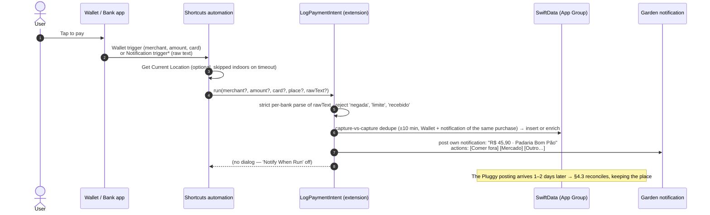

- **Both triggers are on for every card** (your choice: Nubank, Inter, BTG). The Wallet and bank-notification captures of one purchase are merged by capture-vs-capture dedupe (same amount, within ±10 min, same institution). The first capture wins, and the second adds whatever the first was missing (merchant name from Wallet, Pix/physical-card coverage from notifications).
- Notification permission is requested in the app (onboarding), not from the extension.
- **Real notification formats (Nubank + BTG, verified 2026-10-03):**
  - The title carries the method: "Compra no débito / crédito aprovada", "Transação Pix Confirmada", "Pix Recebido", "Transferência recebida".
  - Incoming BTG Pix includes the payer's **name, CNPJ and memo** ("… 12.345.678/0001-90 no valor de R$ 6.000,00 - Prestação de serviço").
  - Outgoing BTG Pix and incoming Nubank transfers name **no counterparty**. When an outgoing and an incoming notification of the same amount arrive from different banks within ±15 min, they are paired in real time as *Entre minhas contas* ("BTG → Nubank").
  - Nubank cuts merchant names short ("MINIMERCADOEXEMPL").
- **⚠️ Spike:** an extension-posted notification with dynamic category actions has to be tested on a device. Fallback: a static "Mudar limite" action that opens the app on the transaction.

---

## 15. App structure & navigation

Tabs are now **Início · Movimentações · Planejamento · Meu dinheiro · Buscar**. Onde gastei moved into Movimentações, and Search took its tab ([REVIEW.md](REVIEW.md) U1).

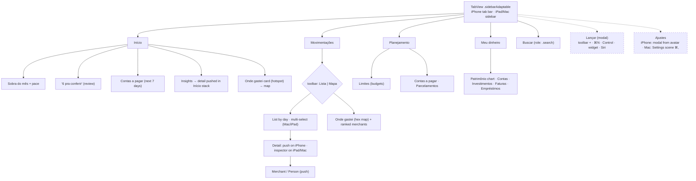

| | iPhone | iPad | Mac |
|---|---|---|---|
| Nav | Tab bar (5) | Sidebar with a **Limites** section (drop targets) + content + inspector | Same as iPad, plus menu bar commands, ⌘1–⌘5 |
| Add | `+`, Control (opens the app on the sheet), Action button, widget, Siri ("Lançar 30 na feira") | `+`, ⌘N | ⌘N |
| Move to budget | Budget pill **menu** on the row (44 pt target, not the row's tap area), with the top 3 inline in the context menu | Same, plus drag merchant → sidebar budget | Select → keys `1`–`9` (`onKeyPress`), multi-select bulk actions |
| Import OFX | Open-in (Garden registers `.ofx`/`.qfx`), Share sheet | Drag & drop | Drag & drop, File ▸ Importar (⌘⇧I) |
| Detail | Push | Inspector | Inspector (⌘⌥I) |

**Accessibility rule:** every long-press, swipe or drag action also exists as a **visible button or menu** on the detail screen. Layouts are verified at **AX5** Dynamic Type. Onde gastei always has a ranked list next to the map.

---

## 16. Widgets & Controls

| Kind | Content |
|---|---|
| Small | **Sobra do mês** R$ 1.240, a pace ring, "12 dias". Configurable to a single limit (e.g. Mercado). |
| Medium | Sobra + the 3 limits closest to running out |
| Large / XL portrait (27) | + trend + the next 3 contas a pagar |
| Lock circular / rectangular / inline | Gauge · "R$ 1.240 · R$ 103/dia" · "R$ 103/dia" (whole month or one chosen limit) |
| Control (iOS 18+/macOS 26+) | **Lançar**: opens the app on the Add sheet. Needs an unlock from the Lock Screen. |
| Interactive | "6 pra conferir" button: **opens** the review screen. It never accepts items blindly. |

Widget reloads after ingestion are **debounced** (at most 1 per 5 min while in the background) to stay inside the reload budget. Tinted and clear rendering modes are verified.

---

## 17. Visual system & copy

- **Accent (one, locked):** Garden green, `#2E7D4F` in light mode and `#4CC27E` in dark. Used only for primary actions, selection and progress.
- **Money:** expenses in `label` color. Income shows a `+` and secondary green. Over-limit uses `systemRed` as a *status* color, never as the accent.
- **Greys:** system cool greys. **Shapes:** actions are capsules, cards use 20 pt continuous corners, chips are capsules.
- **Type:** SF Pro text styles, `.monospacedDigit()` on every amount, one display size per screen.
- **Icons:** SF Symbols only, no emoji in the chrome.
- **Motion:** system transitions. Only the hero amount uses `.contentTransition(.numericText())`. Reduce Motion is respected.
- **Language:** pt-BR first, then en (String Catalog). Currency formatted as `R$ 1.234,56`; compact form `R$ 1,2 mil`.

**Copy (pt-BR), one label per intent:**

| Concept | Label |
|---|---|
| Tabs | Início · Movimentações · Planejamento · Meu dinheiro · Buscar |
| Budgets | Limites |
| Free to spend | Sobra do mês |
| Review queue | *N* pra conferir · Tudo certo |
| Add | Lançar |
| Own transfer | Entre minhas contas |
| Upcoming | Contas a pagar |
| Installment | Parcelamento · Marcar como parcela · *3/10* |
| Status | Quitado · Atrasado · Não apareceu no banco · Valor alterado |
| Unbudgeted | Fora do planejamento |
| Liquidity | Disponível hoje · Resgate a partir de |
| Map | Onde gastei |
| Split | Dividi a conta |

---

## 18. Phased plan

| Phase | Scope |
|---|---|
| **0** | **Spikes on a device:** (a) the Wallet trigger with your cards; (b) the iOS 27 notification trigger: does it exist and what does it pass; (c) an extension-posted notification with actions. Domain model, Money type, SwiftData + CloudKit, UUIDv5 ids, app shell, Lançar, String Catalog, **icon**. |
| 1 | Worker (pair, items, snapshot, lease, cron, CNPJ), Pluggy ingestion (leader), merchant resolution, categorization 1–6, transfers (§8), tombstones |
| 2 | Limites, Sobra do mês (both modes), widgets + Control, review queue, rules from corrections, Buscar |
| 3 | Capture intents + shortcut templates, reconciliation (§4.3), Onde gastei |
| 4 | Linking (refund, racha, cashback, IOF), Parcelamentos, Contas a pagar, Fatura, Meu dinheiro, insights |
| 5 | OFX/CSV import (Nubank, Inter, Itaú, generic), AX5 pass, full-motion simulator verification on all 3 platforms |
| Later | Spaces UI (Pessoal / Negócio), shared household budget (CloudKit share + "quem pagou"), voice-first cash entry |

---

### Phase 0 status (2026-10-03)

Done and verified on the iPhone 17 Pro simulator (light + dark) and the Mac:
- Domain model (CloudKit-safe, `Int64` centavos, UUIDv5 ids), `Money` pt-BR parsing and formatting, `PayCycle` (payday 5).
- App shell: 5 tabs, adapting to a sidebar on iPad/Mac. Lançar (F1, 2 taps), budget pill (F5, 2 taps), "Sempre em" context menu (F6), review queue (F4), Planejamento with suggestions (F8), Meu dinheiro, Buscar, Ajustes with an automation guide.
- `LogPaymentIntent` (Wallet + bank notification) with capture-vs-capture merge, and `NotificationParser` (8 sample notifications pass: purchases, Pix, installments, declines and received Pix rejected).
- Icon (Icon Composer), Garden-green accent.

Still open for Phase 0: the on-device spikes (Wallet trigger with Nubank/Inter/BTG; the iOS 27 notification trigger and what it passes; real notification texts to harden the parser). CloudKit + App Group need a real bundle id and an iCloud container. Known nit: the default Mac sidebar width truncates "Movimentações".

### Phase 1 status (2026-10-03)

Done and verified end to end in the simulator against a local `wrangler dev` plus a mock Pluggy (`worker/dev/mock-pluggy.mjs`):
- **Worker** (`worker/`): pairing (single-use codes, hashed tokens, rate-limited), item whitelist, trailing-window snapshot (cursor-only pagination, so a hostile `next` can't redirect the API key), single-writer lease, CNPJ cache, hourly `lastUpdatedAt` check, and APNs ES256 pushes (written, untested without a key). 16 vitest tests run inside workerd.
- **App**: Keychain (synchronizable) token and CPF HMAC key; Ajustes ▸ Bancos (pair, items, sync); `SyncEngine` (lease, 12-month first sync, then 35-day windows); `PluggyIngestor`; `TransferDetector`.
  - The ingestor updates known rows, reconciles bank postings with captures (exact amount, installment header, tip tolerance), inserts the rest, and tombstones rows that vanished.
  - The detector finds E2E pairs, own accounts, investments, card bills (paired into one row) and saque → Carteira.
- **Verified with the mock:** the first sync gave 7 new + 10 confirmed captures with no double counting. The second gave 17 updated (idempotent). Dropping a transaction gave 1 removed. Titles read "BTG → Nubank", "Nubank → Carteira", "Fatura …" and "Magalu 1/10".

Still open: deploying to your Cloudflare account and connecting real Meu Pluggy items. APNs registration in the app (needs the push entitlement and a real bundle id) and `BGAppRefreshTask` come with the CloudKit work.

### Changes after first real sync (2026-10-03)

- **Categories are the budgets.** Each category can carry one limit per pay cycle (`SpendCategory.limitCents`). The grouped "Limites" (`Budget`) are retired; the model stays only so existing stores open. Tabs: Início · Extrato · Categorias · Patrimônio · Buscar.
- **Salary:** "Marcar como salário" remembers the payer (CNPJ or person) and offers the cycle start day. "Sobra do mês" can be *Pelo salário* (salary + other income − all spending) or *Pelos limites*.
- Open Finance descriptions arrive as `Operação|Contraparte` and are split into payment method + counterpart. Pluggy's generic "Transfers" category is not treated as a transfer between my own accounts.

### Widgets (2026-10-03)

- **Extension:** `GardenWidgets`. The app writes a small `WidgetSnapshot` (Sobra, baseline, spent, top categories) to the App Group `group.br.com.zesmoi.Garden`, debounced after every store save and every settings change. The widget never opens the SwiftData store.
- **Widgets:**
  - **Sobra do mês:** small, medium (with top categories and "Lançar"), and lock screen circular, rectangular and inline.
  - **Para onde foi o dinheiro:** medium (ring) and large (ring, Sobra, top 5 categories).
  - **Control:** "Lançar" for Control Center and the Lock Screen.
- **Links:** `garden://add`, `garden://home` and `garden://categories`, handled in `RootView.onOpenURL`.
- **Timeline:** rolls over at midnight. The app reloads it whenever the numbers change.

## 19. Decisions (answered 2026-10-03)

| Question | Answer | Consequence |
|---|---|---|
| Distribution | **Personal use** (TestFlight / Xcode installs) | Meu Pluggy terms are satisfied. BYO Worker + Pluggy credentials, no multi-tenant concerns. |
| Banks | **Nubank, Inter, BTG** | First notification parsers: Nubank, Inter, BTG. All three go into Meu Pluggy (3 of 5 connections). BTG also carries investments, which feed Meu dinheiro. |
| Capture triggers | **Both** (Wallet + bank notification) on every card | Capture-vs-capture dedupe is required from Phase 0 (§14). |
| Payday | **5th** | Cycle = 5th → 4th of next month. `Sobra do mês` and every budget use this cycle. |
