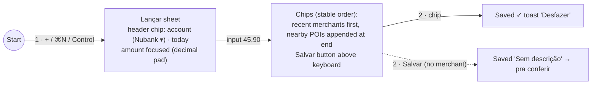
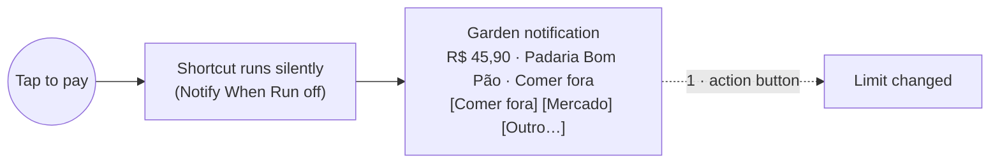
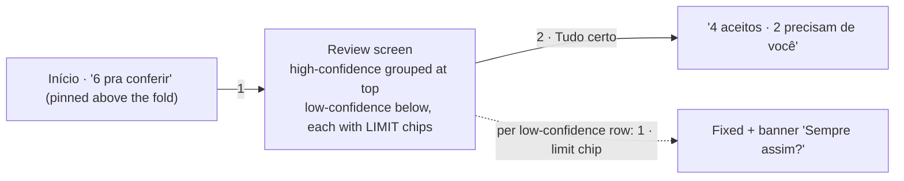
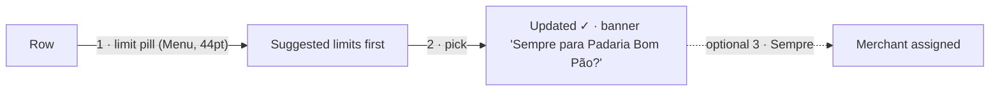
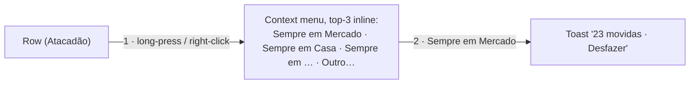
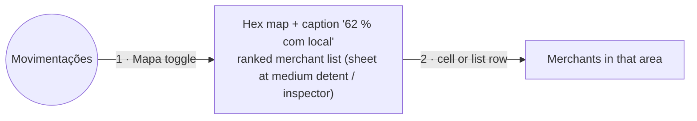
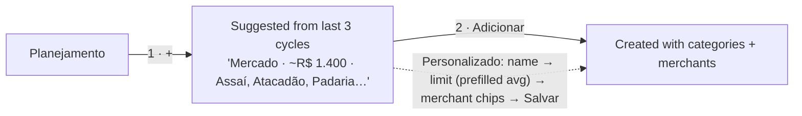
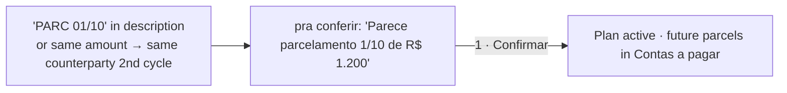
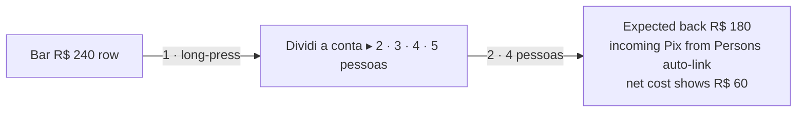
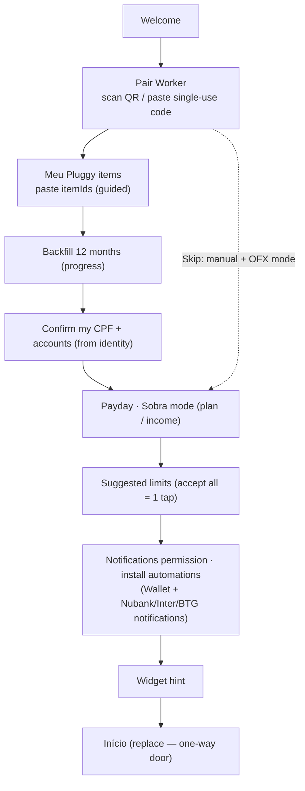

# Garden — User flows (v0.2, after agent review)

**Target: every frequent task in ≤ 2 taps.** These counts are **honest counts** from the audit ([REVIEW.md](REVIEW.md)), not best-case counts.

Counting rules:
- A **tap** is one discrete pointer or keyboard command: a tap, click, swipe action, menu choice, submenu (▸ counts as a tap), shortcut key, scroll needed to reach the target, or keyboard dismissal.
- Typing a value (amount, name) is **input**, not a tap.
- One-time setup is exempt but should still be short.

Frequency: **D** daily · **W** weekly · **M** monthly.

## Scorecard

| # | Flow | Freq | iPhone | iPad | Mac | v0.1 claim |
|---|---|---|---|---|---|---|
| F1 | Lançar a purchase by hand | D | **2** | 2 | 2 | 2 (really 2–4) |
| F2 | Automatic capture / fix its limit | D | **0 / 1** | — | — | 0 / 2 |
| F3 | How much is left (overall or one limit) | D | **0** | 0 | 0 | 0 |
| F4 | Conferir new transactions | D | **2** | 2 | 1 per row | 2 (unsafe) |
| F5 | Move a transaction to another limit | D | **2** | 2 | 2 | 2 (really 3) |
| F6 | Always put this merchant in a limit | W | **2** | 2 | 2 | 2 (really 3) |
| F7 | Where am I spending the most | W | **2** | 2 | 2 | 1–2 |
| F8 | Create a limit | M | **2** | 2 | 2 | 2 (custom 5+) |
| F9 | Same-person Pix | W | **0 / 1** | 0 / 1 | 0 / 1 | 0 / 2+2 |
| F10 | Parcelamento outside the card | M | **1** (suggested) | 1 | 1 | 3 (really 5–7) |
| F11 | Import an OFX | M | **2** | 1 (drop) | 1 (drop) | 2 (really 3–4) |
| F12 | Net worth & investments | W | **1** | 1 | 1 (⌘4) | 1 |
| F13 | Is rent / food going up? | M | **0–1** | 0–1 | 0–1 | 0–1 (really 1–3) |
| F14 | Find a transaction ("iFood este mês") | D | **1** + input | 1 | 1 (⌘F) | missing |
| F15 | Split the bill (racha) | W | **2** | 2 | 2 | missing |
| F16 | Saque then cash spending | W | **0** + F1 | — | — | double counted |
| F17 | How much will the fatura be? | W | **2** | 2 | 2 | missing |

---

## F1 · Lançar a purchase by hand (D) — 2

Start: anywhere. The Control or Action button also works, but needs an unlock from the Lock Screen.

- The chip row **never reorders after it appears**, so a tap can't land on a chip that moved. The account chip is visible **before** saving.
- **Mac:** Return picks the first chip, ⌘1–⌘5 pick the others.
- **Voice:** "Ei Siri, lançar 30 na feira" (App Shortcut, 0 taps).

## F2 · Automatic capture (D) — 0, or 1 to fix

The fix is 1 tap after expanding the notification. Expanding it on the Lock Screen also needs Face ID. ⚠️ This is spike-dependent (DESIGN §14). The fallback is a static "Mudar limite" action, which opens the app.

## F3 · How much is left (D) — 0

Widget or Lock Screen accessory, set to the whole month **or one chosen limit** ("Mercado: R$ 310").

## F4 · Conferir (D) — 2

- "Tudo certo" accepts **only high-confidence rows**. It never accepts a row you haven't seen.
- The widget button **opens** this screen and does nothing else.
- **Mac:** a filtered list. Return accepts and moves to the next row, keys `1`–`9` pick a limit.

## F5 · Move a transaction to another limit (D) — 2

- The pill is a separate target. Tapping elsewhere on the row opens the detail.
- **Mac:** select the row, then press `1`–`9`.

## F6 · Always put this merchant in a limit (W) — 2

- **iPad/Mac:** drag the merchant onto Limites ▸ Mercado in the sidebar (1 drag).
- **Accessibility:** the same action appears as a button on the Merchant screen.

## F7 · Where am I spending the most (W) — 2

The **Onde gastei** card on Início shows this month's hotspot (0–1 taps).

## F8 · Create a limit (M) — 2

## F9 · Same-person Pix (W) — 0, or 1 when unsure

- Certain (E2E pair or own account): **0 taps**. The row shows "Entre minhas contas".
- Unsure (masked CPF): in *pra conferir*, the row asks "É você mesmo?" with **Sim / Não** (1 tap). "Sim" remembers that account.
- Overriding a detection: the badge menu offers "É um gasto em: Mercado · Casa · …" inline, so it takes 2 taps and needs no budget step afterwards.

## F10 · Parcelamento outside the card (M) — 1 (suggested)

**Manual:** detail ▸ "Marcar como parcela" opens a sheet with the counterparty prefilled. N is a number field, not a stepper, and the total is prefilled as amount × N. That's 3 taps, which is acceptable because it's rare.

## F11 · Import an OFX (M) — 2 on iPhone, 1 drop on iPad/Mac

- **iPhone:** in Files or Mail, tap the `.ofx` attachment (1), and it opens in Garden because Garden registers the file type. If the account matches automatically and nothing conflicts, it imports straight away with a toast "48 novas · 12 já existentes · Desfazer" (2 counted from Mail, where opening the attachment is the extra tap).
- **iPad/Mac:** drop the file onto the window (1).
- The preview only appears when the account can't be matched or conflicts are found.

## F12 · Net worth (W) — 1

Meu dinheiro tab. Headline: "Patrimônio R$ 212 mil · Investido R$ 84.300 · Disponível hoje R$ 31.000".

## F13 · Is rent / food going up (M) — 0–1

Insight cards on Início, and "vs. normal" shown on every budget row in Planejamento. Tapping an insight pushes its detail **within Início's stack**.

## F14 · Find a transaction (D) — 1 + input

Buscar tab (Mac: ⌘F). Type "ifood" and get a summary card ("iFood · este mês R$ 412 · 9 pedidos") above the results.

## F15 · Split the bill (racha) (W) — 2

Counts as 2 because the person count is listed inline. When Garden sees ≥ 2 Pix of a similar amount arriving soon after an expense, it suggests "Isso é racha do Bar X?" in pra conferir (1 tap).

## F16 · Saque, then spending the cash (W) — 0 + F1

Saque is detected automatically as a transfer to **Carteira**. Lançar defaults its account chip to Carteira for the 3 days after a saque.

## F17 · How much will the fatura be (W) — 2

Meu dinheiro (1) ▸ card row (2): open bill, closing and due dates, parcels coming in future bills. Also on the Large widget.

---

## Onboarding (one-time, exempt)

**Back navigation:** finishing onboarding is a one-way door (`replace`); back can't return to it. Pairing errors appear inline. A failed backfill can be resumed from Ajustes.
