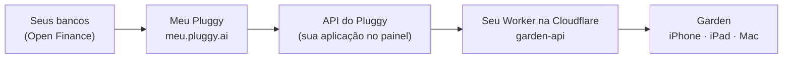

# Conectando seus bancos ao Garden com o Meu Pluggy

Este guia leva você do zero até ver as movimentações do Nubank, Inter, BTG (ou de qualquer banco do Open Finance) no Garden. São cerca de 20 minutos, uma vez só.

## Como funciona



- **Meu Pluggy** é gratuito e serve para uso pessoal. Você autoriza cada banco pelo Open Finance, uma vez.
- O **painel do Pluggy** (dashboard.pluggy.ai) dá a você um `CLIENT_ID` e um `CLIENT_SECRET` para ler esses dados.
- O **Worker** roda na sua conta da Cloudflare e guarda essas credenciais. O app nunca vê o segredo, e o Worker não guarda suas transações: só repassa.
- O **Garden** pareia com o Worker por um código de uso único e sincroniza.

> **Limites do Meu Pluggy:** até 5 conexões, só uso pessoal (nada comercial). Os dados atualizam **uma vez por dia**, então as movimentações chegam com 1–2 dias de atraso. Para ver os gastos na hora, configure também a captura do Apple Pay e das notificações do banco em **Ajustes ▸ Captura automática**.

---

## 1. Conecte seus bancos no Meu Pluggy

1. Acesse **meu.pluggy.ai** e crie uma conta. Use o **mesmo e-mail** que vai usar no painel do Pluggy.
2. Conecte cada banco, **um de cada vez**. Cada um abre o app do banco para você autorizar o compartilhamento pelo Open Finance.

## 2. Crie sua aplicação no painel do Pluggy

1. Acesse **dashboard.pluggy.ai** e entre com o mesmo e-mail.
2. Em **Aplicações**, abra a sua aplicação (o painel cria uma de desenvolvimento) e copie o **Client ID** e o **Client Secret**.

> ⚠️ A conta do painel começa com um **trial de 15 dias**. Faça os passos 3 e 4 **dentro desse prazo**: o acesso ao Meu Pluggy para uso pessoal continua depois, mas o conector precisa estar ativado antes. Se passar do prazo, o suporte do Pluggy estende pelo Discord.

## 3. Ative o conector MeuPluggy

1. No menu lateral, abra **Dados Financeiros ▸ Customização ▸ Conectores**.
2. Busque por **meupluggy**. Em **Personal ▸ Conectores Diretos** aparece **(200) MeuPluggy**.
3. Se a chave dele estiver clarinha (desabilitada), desligue **"Padrão para todos selecionados"** no topo e ligue a chave do MeuPluggy.
4. Clique em **Salvar**.

## 4. Conecte o Meu Pluggy e pegue os itemIds

1. Na **Visão Geral**, use **"Conecte um item demo" ▸ Conectar** (ou **Aplicações ▸ sua aplicação ▸ Demo**).
2. No widget, escolha **MeuPluggy**, *não* o banco, e entre com o login do meu.pluggy.ai.
3. Depois de conectar, a tela de Demo lista os **itens conectados**, um por banco. Clique em cada um e copie o **ID**, um código como `a1b2c3d4-e5f6-4a7b-8c9d-0e1f2a3b4c5d`.

Guarde esses IDs; você vai colá-los no app.

## 5. Publique o Worker na sua Cloudflare

Você precisa do **Node.js 22+** e de uma conta gratuita na Cloudflare.

```bash
cd worker
npm install --legacy-peer-deps
npx wrangler login
npx wrangler secret put PLUGGY_CLIENT_ID       # cole o Client ID
npx wrangler secret put PLUGGY_CLIENT_SECRET   # cole o Client Secret
npx wrangler secret put ADMIN_TOKEN            # invente uma senha longa; só você usa
npx wrangler deploy
```

O `deploy` mostra o endereço do seu Worker, algo como `https://garden-api.SEU-USUARIO.workers.dev`. Para conferir se ele está no ar:

```bash
curl https://garden-api.SEU-USUARIO.workers.dev/v1/health
# {"ok":true}
```

## 6. Pareie o app com o Worker

Gere um código de pareamento (vale 10 minutos e funciona uma vez só):

```bash
GARDEN_URL=https://garden-api.SEU-USUARIO.workers.dev ADMIN_TOKEN='a-mesma-senha' npm run pair
```

> Sem `GARDEN_URL`, o comando tenta o servidor local do `npm run dev`. É por isso que aparece `ECONNREFUSED 127.0.0.1:8787`.

No Garden, abra **Ajustes ▸ Bancos (Meu Pluggy)**, cole o **endereço** e o **código** e toque em **Conectar**.

## 7. Adicione os bancos e sincronize

1. Na mesma tela, cole cada **itemId** no campo "itemId do Meu Pluggy" e toque em **Adicionar**. O Worker confere cada ID no Pluggy antes de aceitar.
2. Toque em **Sincronizar agora**. A primeira sincronização traz **até 12 meses** de histórico e pode levar um minuto.
3. Embaixo do botão aparece o resumo: contas, movimentações novas, confirmadas pelo banco, atualizadas e removidas.

Depois disso, o Garden sincroniza sozinho ao abrir o app, ao voltar para ele e quando você puxa a lista para baixo.

---

## O que o Garden faz com os dados

- **Confirma as capturas:** um gasto registrado na hora pelo Apple Pay ou pela notificação do banco é casado com o lançamento do banco, sem contar duas vezes. A captura mantém o local, e o banco acrescenta o CNPJ e os identificadores.
- **Reconhece transferências entre suas contas:** um Pix do BTG para o Nubank vira **"BTG → Nubank"**, e não um gasto. O mesmo vale para pagamento de fatura, saque (vai para a Carteira) e aplicações.
- **Identifica quem você pagou:** consulta o CNPJ no registro público da Receita (via BrasilAPI) para ter o nome fantasia, a atividade e o endereço. Pix para pessoas aparece com o nome da pessoa.
- **Parcelamentos:** compras parceladas no cartão viram um plano "1/10, 2/10…".

## Problemas comuns

| O que aparece | O que fazer |
|---|---|
| `fetch failed … ECONNREFUSED 127.0.0.1:8787` no `npm run pair` | Faltou o `GARDEN_URL` do Worker publicado (passo 6). |
| "ADMIN_TOKEN recusado" | Use exatamente o valor do `wrangler secret put ADMIN_TOKEN`. |
| "Código inválido ou expirado" | O código vale 10 minutos e uma vez só. Gere outro. |
| "Muitas tentativas" | 5 tentativas erradas por hora por rede. Espere uma hora. |
| "Item não encontrado no Pluggy" ao adicionar | O ID não é desta aplicação, ou foi copiado errado. Copie de novo na tela de Demo. |
| `Erro do servidor (502): pluggy_error 403 /accounts` | O Pluggy recusou o acesso. Confira o passo 3 (conector ativo) e se o trial do painel não expirou. |
| "Indisponível: … identity / loans / bills" em laranja | O Pluggy não oferece esse produto para o seu item. É só um aviso; contas e transações continuam chegando. |
| "Atualizado há X horas" e nada novo | O Meu Pluggy atualiza uma vez por dia. Espere a próxima atualização ou use a captura automática para ver os gastos na hora. |
| "Outro aparelho está sincronizando agora" | Só um aparelho importa os dados do banco de cada vez, para não duplicar. Espere alguns minutos. |

## Privacidade

- O `CLIENT_SECRET` e a chave temporária do Pluggy ficam só no Worker, na sua conta da Cloudflare.
- O Worker **não armazena** transações. Ele guarda apenas a lista de itemIds, o hash dos tokens dos aparelhos pareados, uma trava de sincronização e um cache de CNPJs.
- O token do aparelho fica no **Chaveiro do iCloud**. Seu CPF nunca é salvo em texto: o app guarda só um HMAC, para reconhecer Pix para você mesmo.
- Para desconectar um aparelho: **Ajustes ▸ Bancos ▸ Desconectar este aparelho**.

Detalhes técnicos do Worker estão em [worker/README.md](../worker/README.md). O desenho completo está em [DESIGN.md](DESIGN.md) §13.
